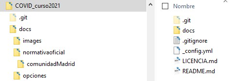

# Tabla de Contenidos

* Tabla de Contenidos
{:toc}
# Propósito

Debido a la falta de agilidad que tiene la administración pública a la hora de analizar alternativas e implantar las mas adecuadas es necesario anticipar los posibles escenarios a los que como padres nos vamos a enfrentar el próximo curso debido al  COVID19.

El propósito de este conjunto de páginas es consolidar la información disponible a nivel internacional, nacional, comunidad autónoma y local para que, como padres, podamos tener opciones que permitan tener a nuestros hijos la mejor educación posible manteniendo la seguridad sanitaria de todos.

La agilidad que se puede conseguir mediante la colaboración individual es muy superior a la que se puede conseguir desde la administración (p.e. Una notificación entre padres de una clase en comparativa con una notificación al colegio y desde el colegio al resto de padres). Sin embargo esa agilidad viene con ciertas particularidades:

* Alineamiento con la norma: Aunque aquí se debatan alternativas y se presenten opciones, estás están por debajo de cualquier norma o reglamento procedente del gobierno nacional o autonómico o del colegio/instituto. 
* Voluntariedad: Se presentan opciones para poder ser tenidas en cuenta por los padres, pero en última instancia cada familia tiene que tomar sus propias decisiones
* Adaptabilidad: Conforme aprendemos y vemos resultados las opciones disponibles se pueden ampliar o reducir, incluso descartar. 

# Como colaborar

El contenido de estas páginas se controla como un repositorio de github 

Existe multitud de paginas y videos sobre como usar github. Para este repositorio es muy poco lo que hay que aprender asi que existe el fichero [github.md](github.md) donde se explica los pasos minimos a seguir para colaborar

Las paginas son generadas a partir del directorio /docs

Si quieres contribuir con ideas o quieres debatir ciertos aspectos lo puedes hacer [aqui](https://github.com/f-alonso-vendrell/COVID_curso2021/issues), usando las "Issues" = "Incidencias" de github, para ver como darte de alta en github sigue el paso 1 de nuestra [guia](github.md)

Si quieres colaborar modificando el contenido puedes hacerlo [aqui](https://github.com/f-alonso-vendrell/COVID_curso2021) donde se indica como hacerlo o siguiendo nuestra [guia](github.md)

# Opciones disponibles

Se presentan diferentes temas/opciones y los diferentes escenarios donde pueden ser aplicadas.

Las opciones se incluyen [aqui](opciones/index.md)

# Escenarios

## Escenario I Presencialidad y medidas extraordinarias de higiene

Educación Primaria: Grupos estables de convivencia.

[Opciones escenario I para colegios, padres y madres](escenario1.md)

Referencias:

[Comunidad de Madrid](normativaoficial/comunidadMadrid/index.md)

## Escenario II Semipresencialidad

**PENDIENTE**

## Escenario III Confinamiento

**PENDIENTE**

# Referencias

* [Normativa](normativaoficial/index)

